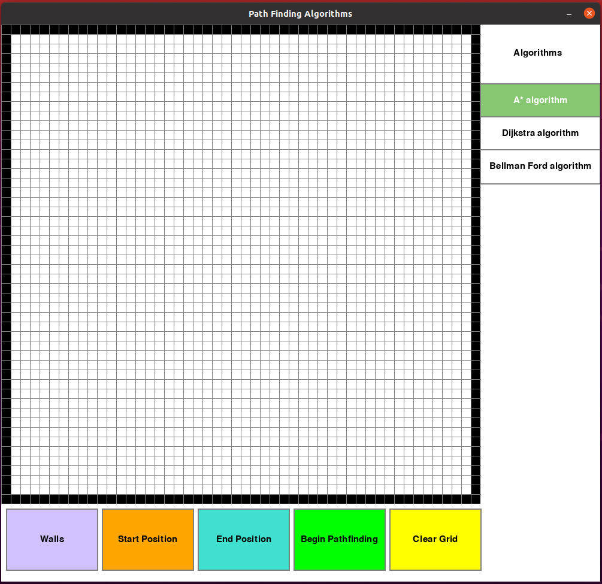
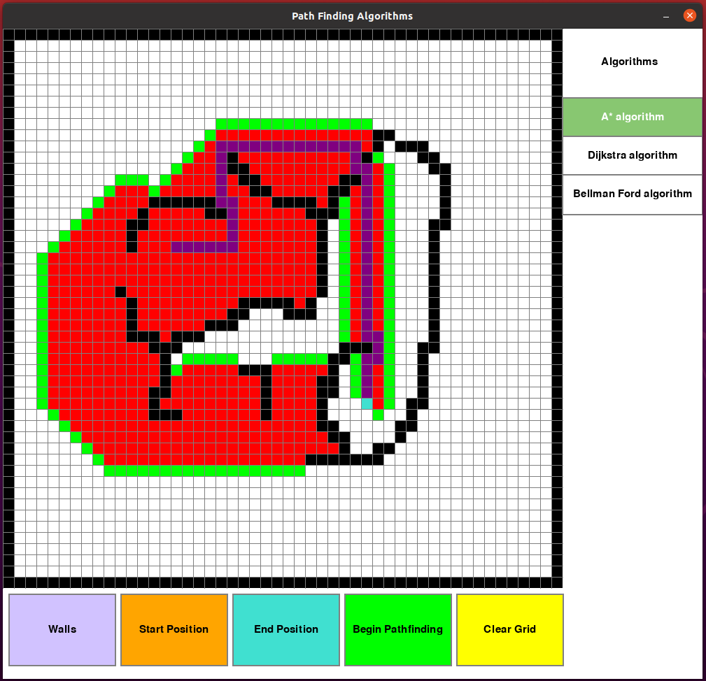

# pathfinder-pygame
## Pathfinder visualizer using Pygame 

*Obs: Only A\* algorithm working currently*

Pathfinder is a project where you can see the visualization of minimum path algorithms working. To run this program you have to download it, certify that you have Python3 and Pygame installed in your computer ( more informations about [Python](https://www.python.org/downloads/) and [Pygame](https://pypi.org/project/pygame/instalation)), and run the follow command at the project folder at the terminal:

~~~
python main.py
~~~

If you're OS is linux or mac run

~~~
python3 main.py
~~~

Than will appear the following user interface where you have the following buttons to select:

* **Walls**: Add walls to the grid clicking with the left click and remove with the right click
*  **Start position**: Add start position to the grid clicking with the left click and remove with the right click
*  **End position**: Add end position to the grid clicking with the left click and remove with the right click
*  **Begin pathfinding**: Run the chosen algorithm on the grid
*  **Clear grid**: Clear everything on the grid 

